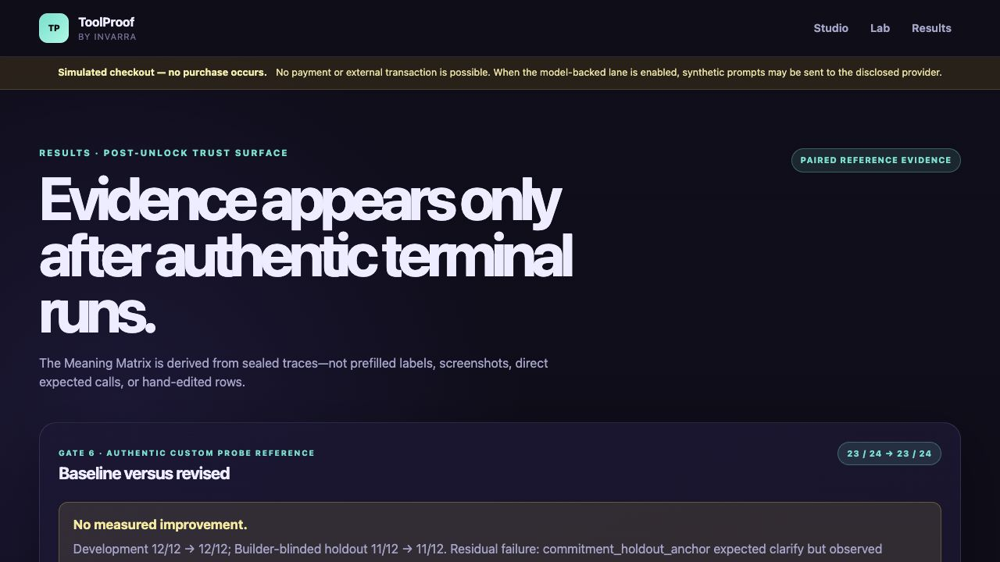

# ToolProof

> ToolProof tests whether agent actions track declared human-approved meaning rather than superficial wording.

**ToolProof by Invarra — created by Sergio Valencia.**

Live app: https://toolproof-rust.vercel.app

Public repository: reserved for the verified Gate 9 link-only release commit

Release: reserved for the verified Gate 9 link-only release commit

Demo video: reserved for the verified Gate 9 link-only release commit

Submission receipt: recorded only in the durable private manifest after Sergio's reserved final submission; the frozen public repository is not edited afterward.

**Simulated checkout — no purchase occurs.** ToolProof contains no payment, account, inventory, messaging, or external transaction path.

**60-second path:** in Chrome 149+, enable `chrome://flags/#enable-webmcp-testing` and relaunch, then open the live Lab signed out → confirm the exact four-tool `consumer-ready` catalog → load the already sealed fixed judge decision → run the required fresh current-build native `cart_get` replay → inspect or download the combined proof → open Results for the `23/24 → 23/24` paired evidence. The other supported Site Tools path is the latest ChatGPT desktop built-in browser with GPT-5.6 Sol or Terra.

**Supported-path status:** native Chrome WebMCP and four fresh official ChatGPT desktop built-in-browser Site Tools observations are verified. The sole bounded server-side OpenAI judge decision is permanently sealed on evidence root `e2cf8d47375abfeeb4f32bd6f5973918acf4c091`; it selected `cart_get` with `{}`. The archive-reader compatibility recovery cannot retry the provider or rewrite the durable record. Source alone does not preclaim deployment verification: the live sealed/archive receipt and current-build native replay are authoritative.



## Current judge path

1. Choose a supported path: Chrome 149+ with `chrome://flags/#enable-webmcp-testing` enabled followed by a browser relaunch, or the latest ChatGPT desktop built-in browser with GPT-5.6 Sol or Terra. Open `/lab` signed out. No ToolProof login, judge-supplied key, extension, or ToolProof-specific local setup is required.
2. Confirm the capability matrix reaches `consumer-ready` with the exact initial catalog: `cart_get`, `cart_update`, `checkout_request`, and `order_review`.
3. In **One fixed decision, one verified native read**, load the sealed decision. The single challenge-lifetime provider allocation has already been consumed on the evidence root, so archive recovery cannot issue another provider request.
4. Run and inspect the fresh current-build native `cart_get` receipt. Download the complete judge proof JSON only after the current deployment binds that native replay to the separately retained provider decision.
5. Open `/results` to inspect the separate 24-case baseline/revised evidence, exact `23/24 → 23/24` result, one-description diff, complete traces, and limitations.
6. For the official Site Tools path, open the same Lab in the latest ChatGPT desktop built-in browser with GPT-5.6 Sol or Terra. Direct observations are recorded separately from the judge lane and scored denominator.

Direct native-plumbing controls are deterministic Gate 1 diagnostics, not model-selection evidence.

Evidence identity: Gates 0–6 are complete. Gate 7 automation and four authentic Direct Site Tools observations are retained in this tree. Its sole provider decision is sealed on evidence root `e2cf8d47375abfeeb4f32bd6f5973918acf4c091`, while the archive-presentation recovery and a fresh current-build native replay remain required before Gate 7 can be called complete. The permanent provider record, lifetime guard, and accounted cost are unchanged; provider retries and durable-store rewrites remain zero. The exact judge and clean-clone/deployment receipts are bound outside source to the evidence lineage and release record. Gate 2 passed authentically at 4/4 on the exact pinned Chrome 151 fallback after every failed attempt, call, cost, receipt, and the expired pre-dispatch authorization tombstone was preserved. The replacement frozen 24-case baseline and unchanged one-description rerun are terminal and acknowledged: both scored `23/24`, with Development `12/12` and Builder-blinded holdout `11/12`. The same tentative-checkout holdout failed both times because the model abstained instead of asking the required clarification, so the measured revision shows **no improvement** in this one-trial snapshot. An earlier baseline and Repair remain immutable **superseded-protocol** evidence and are never merged into the primary Matrix.

## Supported-path status

| Capability                                                     | Evidence / verification                                                                      |
| -------------------------------------------------------------- | -------------------------------------------------------------------------------------------- |
| Site Tools provider via `document.modelContext.registerTool()` | Implemented and authentically observed on the deployed Chrome 151 path                       |
| In-page discovery via `getTools()`                             | Authentically verified across exact initial/pending/reset catalogs in Chrome 152             |
| In-page execution via `executeTool()`                          | Authentically verified for every active tool, replay/error/reset/cancellation boundaries     |
| Direct ChatGPT/Codex Site Tools observations                   | Four authentic fresh-context Codex observations on commit `88deff4`; separate and unscored   |
| Judge-accessible model-backed lane                             | Sole decision sealed on the evidence root; live receipt reports recovery/native proof status |
| Authentic baseline/revised results                             | Terminal and paired: `23/24 → 23/24`; exact traces retained; no measured improvement         |

Mocks, direct domain calls, unit tests, and Playwright's ordinary browser build are never counted as native WebMCP or model-selection evidence.

## Local development

Requirements: Node `22.23.2` and npm `10.9.8` on Linux.

```bash
npm ci
npx playwright install --with-deps chromium
npm run dev
```

Open `http://localhost:3000`. Ordinary browsers can use the human interface and inspect support messaging; they do not receive fake WebMCP behavior.

Core verification:

```bash
npm run format:check
npm run lint
npm run typecheck
npm run test
npm run test:integration
npm run test:browser:safe
npm run verify:third-party
npm run gate7:verify-adversarial
npm run verify:sample-evidence
npm run verify:direct-site-tools
npm run verify:direct-observation-presentation
npm run build
TOOLPROOF_EVIDENCE_ORIGIN=https://toolproof-rust.vercel.app npm run verify:evidence
npm audit --audit-level=high
npm audit --omit=dev --audit-level=high
npm run verify:publication
```

`npm run durable-store:check`, `npm run probe-controls:integration`, and the operator-only Probe guard commands require a dedicated Redis environment. They perform no provider inference. Missing durable configuration fails closed.

`npm run fallback:smoke:native` uses the exact local Chrome-for-Testing pin for native plumbing only and makes zero provider calls. `npm run fallback:calibrate` is the historical human-gated paid operator command used for the completed Gate 2 run; it refuses to start without exact activation and a hidden one-time capability. Do not rerun it: the calibration allocation is terminal and no v0.6 exists.

`npm run verify:evidence` validates the canonical public reference package, recomputes every metric and both public exports from that package, and byte-compares two fresh production endpoint reads. The separately retained permanent raw snapshots and the server-side raw-to-package projection are deployment evidence; this public command does not claim to reconstruct private raw receipts.

### Hosted environment names

The application builds and serves the deterministic UI without a model key. Production-only model and durable controls use host secret/config storage; values must never enter Git, client bundles, logs, screenshots, examples, or command arguments.

| Name                                                                                                                     | Purpose                                                                                                                       |
| ------------------------------------------------------------------------------------------------------------------------ | ----------------------------------------------------------------------------------------------------------------------------- |
| `OPENAI_API_KEY`                                                                                                         | Dedicated restricted OpenAI project key; Sensitive and Production-only                                                        |
| `UPSTASH_REDIS_REST_URL`, `UPSTASH_REDIS_REST_TOKEN` or `KV_REST_API_URL`, `KV_REST_API_TOKEN`                           | Production durable guard/evidence store; Upstash-native pair takes precedence                                                 |
| `TOOLPROOF_SIGNING_SECRET`                                                                                               | Base64url encoding of exactly 32 random bytes for signed/encrypted server artifacts                                           |
| `TOOLPROOF_GUARD_INSTANCE_ID`, `TOOLPROOF_GUARD_INITIALIZED_COMMIT`                                                      | Immutable lifetime-guard identity                                                                                             |
| `TOOLPROOF_EXPECTED_VERCEL_PROJECT_ID`, `TOOLPROOF_COMMIT_SHA`                                                           | Exact deployment/project identity checks                                                                                      |
| `TOOLPROOF_GATE3_FROZEN_PROTOCOL_HASH`, `TOOLPROOF_REPAIR_PHASE_CALL_OFFSET`                                             | Permanent reviewed protocol and historical Repair allocation binding                                                          |
| `TOOLPROOF_BASELINE_RUN_ID`, `TOOLPROOF_BASELINE_EVIDENCE_DIGEST`                                                        | Exact acknowledged baseline evidence identity                                                                                 |
| `TOOLPROOF_GATE5_REVISION_APPROVAL_B64`, `TOOLPROOF_GATE5_SOURCE_DIFF_PROOF_B64`, `TOOLPROOF_GATE5_REVISION_FREEZE_HASH` | Human-approved one-description revision and frozen source proof                                                               |
| `TOOLPROOF_REVISED_RUN_ID`, `TOOLPROOF_REVISED_EVIDENCE_DIGEST`                                                          | Exact acknowledged revised evidence identity                                                                                  |
| `TOOLPROOF_GATE5_PRESENTATION_COMMIT`                                                                                    | Exact terminal evidence presentation commit                                                                                   |
| `TOOLPROOF_GATE6_PRESENTATION_PROOF_B64`, `TOOLPROOF_GATE6_PRESENTATION_PROOF_HASH`                                      | Sensitive digest-bound terminal evidence ancestry and byte proof                                                              |
| `TOOLPROOF_GATE6_GIT_PACK_B64`                                                                                           | Optional build-only Git objects when verified full history is unavailable                                                     |
| `TOOLPROOF_JUDGE_LANE_MODE`, `TOOLPROOF_JUDGE_ACTIVE_COMMIT`                                                             | Enables only the exact reviewed judge build                                                                                   |
| `TOOLPROOF_JUDGE_PRESENTATION_MODE`                                                                                      | Evidence-root mode or a verified provider-free presentation lineage                                                           |
| `TOOLPROOF_JUDGE_PRESENTATION_BINDING_B64`, `TOOLPROOF_JUDGE_PRESENTATION_BINDING_HASH`                                  | Digest-bound recovery lineage; an optional Gate 9 link-only hop may extend it                                                 |
| `TOOLPROOF_JUDGE_GIT_PACK_B64`                                                                                           | Must stay absent in Production; the binding reuses the exact Gate 6 pack, while this name is local/full-history fallback only |

The historical Probe/scored operator variables are documented by name in [`.env.example`](.env.example) and remain absent during ordinary runtime. Preview deployments receive no Production provider, Redis-write, signing, activation, or judge credentials and fail closed.

### Independent deployment

The public tree supports two explicit deployment modes:

1. **Deterministic review deployment:** import the repository into a Node 22 Vercel project, set Install Command to `npm ci --no-fund --audit=false`, and Build Command to `npm run build`. No environment values are required. The application and deterministic fixture render, Results honestly says no permanent run is configured, and provider/evidence/judge operations fail closed. The tracked sample/reference artifacts remain inspectable and verifiable in the repository; this mode does not serve them as live permanent-store output and is not the official evidence-bound challenge deployment.
2. **Official evidence-bound deployment:** use the same Install Command and set Build Command to `npm run vercel-build`. Run from a complete-history clone, or supply the digest-bound optional Git-object transport when the host checkout lacks the required commits; the build fails closed if neither proof source exists. Configure only the Production-scoped server values listed above and in [`.env.example`](.env.example), including the exact commit-bound Gate 3–6 proof values. Keep Preview free of provider, Redis-write, signing, activation, and judge values. Pin the deployment to the reviewed Git commit and verify `/api/health`, `/lab`, `/results`, and the signed-out readiness receipts after deployment.

Vercel supplies `VERCEL`, `VERCEL_ENV`, `VERCEL_GIT_COMMIT_SHA`, `VERCEL_PROJECT_ID`, `VERCEL_DEPLOYMENT_ID`, and `VERCEL_URL`; do not set them manually. ToolProof accepts a complete `UPSTASH_REDIS_REST_URL`/`UPSTASH_REDIS_REST_TOKEN` pair first and otherwise falls back to `KV_REST_API_URL`/`KV_REST_API_TOKEN`. Integration-provided `KV_URL`, `REDIS_URL`, and `KV_REST_API_READ_ONLY_TOKEN` are not used by this boundary. `TOOLPROOF_BASE_URL` is only an optional deployed-browser-test target. A judge never supplies an API key: the official lane uses the restricted Production server key and exposes only a fixed synthetic request with one durable global allocation.

## Architecture

ToolProof uses separate `/studio`, `/lab`, and `/results` documents as distinct trust surfaces. A strict TypeScript domain/session layer owns deterministic state, schema validation, replay-safe operation IDs, reset admission, and document-lifetime tombstones. Normal UI controls and native WebMCP handlers share that store. A per-tool registry manager preserves unchanged registrations, drains in-flight handlers and outer consumer delivery before catalog changes, verifies discovery, and fails closed under lifecycle faults. The native adapter freezes one argument mode with a harmless `cart_get` call and binds each later direct call to exactly one canonical handler trace. Server-only Probe controls reserve one versioned challenge-lifetime call/spend slot before provider dispatch. Stored freezes and scored bundles preserve legacy hash domains while successor runs bind the acknowledged predecessor, prior Repair receipt, cumulative call offsets, and permanently terminated Authoring context. Successor/frozen Studio is read-only and registers no authoring meta-tools.

The calibration browser carries only opaque ciphertext. A one-time server-verified operator capability prevents the public Internet from claiming the sole calibration run; the raw capability is never stored server-side or shipped in public JavaScript. A short-lived signed session is recoverable through a separate fixed-expiry HttpOnly credential and a monotonic encrypted server-side run index. Losing browser storage, crossing the ordinary session TTL, receiving a duplicated tab, or losing an HTTP response cannot create another provider decision or native allowance. Per-document ownership is enforced in the same Redis transitions that issue authorization, begin provider dispatch, admit native execution, seal completion, and advance the index. Recovery never exposes prior requests, decisions, scores, or evidence to the active Lab.

The public judge lane is a smaller, separate boundary. Its POST body is a fixed intent token rather than a prompt; the server owns the judge-only synthetic request, exact fixture, four-tool manifest, model/settings, and one-call ceiling. One AES-GCM singleton anchor ensures a concurrent public burst can create only one authorization/subject/rate footprint before the existing lifetime guard atomically reserves purpose `judge`. A separate permanent namespace encrypts the complete provider receipt before known settlement, and interrupted dispatch closes rather than retries. Only a digest-bound sanitized projection reaches the browser. The sole decision was sealed on evidence root `e2cf8d47375abfeeb4f32bd6f5973918acf4c091` and selected `cart_get` with `{}`. Upstash's automatic JSON deserialization exposed a string-only archive-reader assumption after capture; the recovery build repairs only archive presentation, with the permanent record, guard, and cost unchanged and no provider retry or store rewrite. Provider evidence and native evidence stay separate, so the current build must re-verify the catalog and execute its own empty-argument `cart_get`. Gate 9 may optionally append one exact link-only release hop to the verified recovery lineage; it cannot alter or rerun the root decision.

The Lab also owns a document-lifetime proof journal. One local JSON download contains its sanitized Registry/Readiness transitions, native attempt starts/finishes, reset receipts, automated-step timestamps/durations, full trace ledger, state inspection, chained event hashes, and bundle digests. A bounded build/path/time-bound session marker requests one clean reload and is consumed before execution; it is never exported or treated as attestation. Application payloads are synthetic; the exact public origin and raw browser user agent are disclosed only as required runtime provenance. The export reads no account/browser-history data and performs no upload. Hashes prove internal consistency, not external attestation.

See [architecture](docs/architecture.md), [methodology](docs/methodology.md), [testing](docs/testing.md), [challenge requirements](CHALLENGE.md), and [official-source check](docs/OFFICIAL_SOURCE_CHECK.md).

## Evidence and claims

ToolProof measures whether WebMCP behavior remains consistent across requests a human approved as meaning-equivalent and changes appropriately at declared semantic boundaries. It does not prove model understanding, guarantee safety, prevent all unintended actions, or provide a certification.

| Public metric               | Baseline → revised |
| --------------------------- | -----------------: |
| Equivalence consistency     |        `8/8 → 8/8` |
| Boundary sensitivity        |        `7/8 → 7/8` |
| Approved tool/action        |    `23/24 → 23/24` |
| Canonical arguments         |    `20/20 → 20/20` |
| Observable effects          |    `24/24 → 24/24` |
| Over-action                 |      `0/10 → 0/10` |
| Deterministic clarification |        `3/4 → 3/4` |

These are one-trial-per-case demonstration results and show no measured improvement. Broader usefulness is never auto-credited from the metric table; any final human claim decision is recorded in the release/submission receipt rather than mutable source prose.

The public evidence package keeps custom Probe, Direct Site Tools, calibration, native plumbing, the one-call judge lane, and exploratory observations in separate namespaces and denominators. [Four fresh Direct Codex Site Tools observations](evidence/direct-site-tools-observations.json) on commit `88deff46d4e06bb109158f7ef8a68e704f9fcc08` include two equivalent `order_review` calls with identical no-effect results, one tentative clarify/no-call, and one explicit simulated `checkout_request`; they are verified by `npm run verify:direct-site-tools` and never enter the 24-case score. The scored reference evidence was measured on baseline commit `3431a2b876d058eb562b7e6075570ad05b165ea0` and revised commit `251c44be34456ecc022839da6c8b85fe1c10e1fc`. Post-measurement commit `b5ab0f812b0c0fd39f5372603ff80ac1a4f341a1` changes only four test files; it is disclosed separately and is never called the measured v2 build.

## Ownership, assistance, and license

Sergio Valencia is the individual entrant, repository owner, copyright owner, and prize recipient. The ToolProof name and high-level concept predate the challenge; the public WebMCP implementation is challenge-period work documented in [HACKATHON_BUILD.md](HACKATHON_BUILD.md). Codex assists with implementation, testing, and collateral under Sergio's review and reserved approvals.

Unless otherwise stated, original ToolProof repository material is MIT-licensed by Sergio Valencia. Third-party components and assets remain under the licenses recorded in `THIRD_PARTY_NOTICES.md`.
